# ChulwalarStudy
Randy Lisbona, Christopher Farrar  
July 27, 2016  

# Introduction
  The Prime Minister of Chulwalar personally invited aspiring SMU Data Scientist Students Randy Lisbona and
  Christopher Farrar to analyze and forecast the islands export data for the year 2015.  Randy and Chris were granted access to the islands economic data and chief statistical scientist, in order to answer the following questions.  
  
  1. What is the best model for the export data and how we define the best?
  
  2. Which forecast model is the best fit and how we define it
  
  3. All of the different models we could consider could be useful or good. How do we choose among equally good
   models


## Analysis steps -Import the data
  The source files provided by the Chulwalar department of statistical analysis and forecasting were imported into R 3.3.1 for time series analysis,  These files were current as of July 18, 2016, reflecting Chulwalar exports data as of December 2015
  
  1. ImportedAsIsDataChulwalar.csv
  2. ImportedPlanDataChulwalar.csv
  3. ImportedIndicatorsChulwalar.csv
  


##  Transform data into time series
In order to be able to work with the partial data sets later, these need to be split into individual vectors and converted into times series.
1. For details on time series conversion please refer to source file "./Analysis/TransformToTimeseries.R"


# Basic data analysis

## Correlation between As Is and Plan Data
Initial analysis involved checking correlation between As Is and Plan data in order to test how exact the planning is. 
  1. Correlation is a measure of linear relationship between two variables. 
  2. The Chulwalar department of statistical analysis and forecasting has done a commendable job in developing the Plan Data!
  

Table: Correlation between As and Plan data

type                          corr 
----------------------------  -----
TotalAsIs-TotalPlan           0.92 
EfakAsIs-EfakPlan             0.91 
WugeAsIs-WugePlan             0.88 
TotalEtelAsIs-TotalEtelPlan   0.92 
BlueEtelAsIs-BlueEtelPlan     0.80 
RedEtelAsIs-RedEtelPlan       0.91 
YearAsIs-YearPlan             0.96 

The results show a very high planning accuracy. 


```
## 
## Call:
## lm(formula = TotalAsIs ~ TotalPlan, data = TotalAsIs)
## 
## Residuals:
##     Min      1Q  Median      3Q     Max 
## -770214 -196776   26017  182579  672705 
## 
## Coefficients:
##              Estimate Std. Error t value Pr(>|t|)    
## (Intercept) 8.959e+04  1.521e+05   0.589    0.558    
## TotalPlan   9.627e-01  4.959e-02  19.413   <2e-16 ***
## ---
## Signif. codes:  0 '***' 0.001 '**' 0.01 '*' 0.05 '.' 0.1 ' ' 1
## 
## Residual standard error: 332600 on 70 degrees of freedom
## Multiple R-squared:  0.8433,	Adjusted R-squared:  0.8411 
## F-statistic: 376.9 on 1 and 70 DF,  p-value: < 2.2e-16
```


```
## 
## Call:
## tslm(formula = TotalAsIs ~ TotalPlan, data = TotalAsIs)
## 
## Residuals:
##     Min      1Q  Median      3Q     Max 
## -770214 -196776   26017  182579  672705 
## 
## Coefficients:
##              Estimate Std. Error t value Pr(>|t|)    
## (Intercept) 8.959e+04  1.521e+05   0.589    0.558    
## TotalPlan   9.627e-01  4.959e-02  19.413   <2e-16 ***
## ---
## Signif. codes:  0 '***' 0.001 '**' 0.01 '*' 0.05 '.' 0.1 ' ' 1
## 
## Residual standard error: 332600 on 70 degrees of freedom
## Multiple R-squared:  0.8433,	Adjusted R-squared:  0.8411 
## F-statistic: 376.9 on 1 and 70 DF,  p-value: < 2.2e-16
```

## STL function (Seasonal Decomposition of Time Series by LOESS
  r stl() was used to seperate the trend, seasonality and remainder (remaining coincidential) components from one another.


  1. The individual time series can be shown graphically and tabularly. 
  2. The trend of the total exports is almost linear. 
  3. A relatively uniform seasonality can be seen.

<!-- --><!-- --><!-- --><!-- --><!-- --><!-- -->

It is interesting to note that the almost linear trend is not seen in the individual segments. The individual trends run partially in opposite directions in the middle of the time scale, which causes the linear trend in the total As Is data.

<!-- -->

## Modify seasonal component to a monthly base
The modification of the seasonality component can also be changed into a monthly view. It only makes sense to do this if the seasonality componant as the trend looks almost identical and the remainder is then randomly spread.

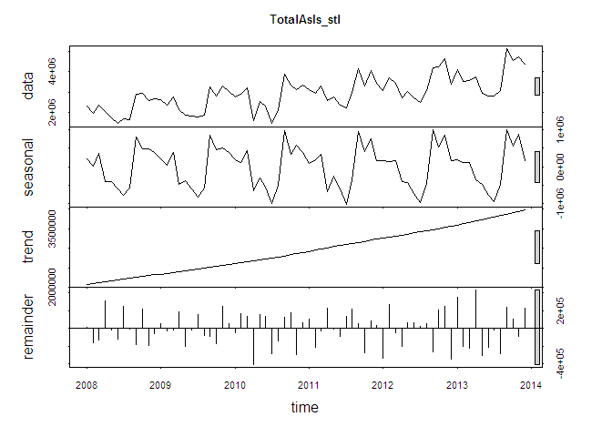<!-- -->

## Correlation with external indicators

The indicators are as follows:

* Monthly Change in Export Price Index (CEPI)
* Monthly Satisfaction Index (SI) government based data
* Average monthly temperatures in Chulwalar
* Monthly births in Chulwalar
* Monthly Satisfaction Index (SI) external index 
* Yearly Exports from Urbano
* Yearly number of Globalisation Party members in Chulwalar
* Monthly Average Export Price Index for Chulwalar
* Monthly Producer Price Index (PPI) for Etel in Chulwalar
* National Holidays
* Chulwalar Index (Total value of all companies in Chulwalar)
* Monthly Inflation rate in Chulwalar
*	Proposed spending for National Holidays
* Influence of National Holiday

The indicators will be converted into individual vectors and subsequently converted into time series. The correlation of the indicators will then be tested against the As Is exports for Chulwalar. 

# Monthly Change in Export Price Index (CEPI)
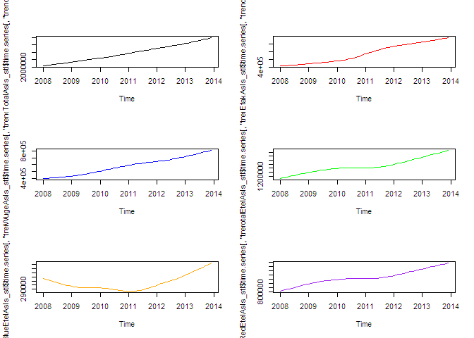<!-- -->

```
## [1] 0.663925
```

```
## [1] 0.9303543
```

```
## [1] 0.7618551
```

```
## [1] 0.339713
```

```
## [1] 0.1448837
```

```
## [1] 0.3587646
```

# Monthly Satisfaction Index (SI) government based data

```r
SIGovVector <- c(ImportedIndicators[16:27,2],ImportedIndicators[16:27,3],ImportedIndicators[16:27,4],ImportedIndicators[16:27,5],ImportedIndicators[16:27,6],ImportedIndicators[16:27,7])
SIGov <- ts(SIGovVector , start=c(2008,1), end=c(2013,12), frequency=12)
plot(SIGov, main="SIGov")
```

<!-- -->

```r
cor(TotalAsIs, SIGov)
```

```
## [1] 0.2007768
```

```r
cor(EfakAsIs , SIGov)
```

```
## [1] 0.37934
```

```r
cor(WugeAsIs, SIGov)
```

```
## [1] 0.3030266
```

```r
cor(TotalEtelAsIs, SIGov)
```

```
## [1] 0.002556094
```

```r
cor(BlueEtelAsIs , SIGov)
```

```
## [1] -0.04146932
```

```r
cor(RedEtelAsIs , SIGov)
```

```
## [1] 0.009978415
```

# Average monthly temperatures in Chulwalar

```r
TemperatureVector <- c(ImportedIndicators[30:41,2],ImportedIndicators[30:41,3],ImportedIndicators[30:41,4],ImportedIndicators[30:41,5],ImportedIndicators[30:41,6],ImportedIndicators[30:41,7])
Temperature <- ts(TemperatureVector, start=c(2008,1), end=c(2013,12), frequency=12)
plot(Temperature, main="Temperature")
```

<!-- -->

```r
cor(TotalAsIs, Temperature)
```

```
## [1] -0.3429684
```

```r
cor(EfakAsIs , Temperature)
```

```
## [1] -0.07951179
```

```r
cor(WugeAsIs, Temperature)
```

```
## [1] -0.2045082
```

```r
cor(TotalEtelAsIs, Temperature)
```

```
## [1] -0.453138
```

```r
cor(BlueEtelAsIs , Temperature)
```

```
## [1] -0.6356067
```

```r
cor(RedEtelAsIs , Temperature)
```

```
## [1] -0.4028941
```

# Monthly births in Chulwalar 

```r
BirthsVector <- c(ImportedIndicators[44:55,2],ImportedIndicators[44:55,3],ImportedIndicators[44:55,4],ImportedIndicators[44:55,5],ImportedIndicators[44:55,6],ImportedIndicators[44:55,7])
Births <- ts(BirthsVector, start=c(2008,1), end=c(2013,12), frequency=12)
plot(Births, main="Births")
```

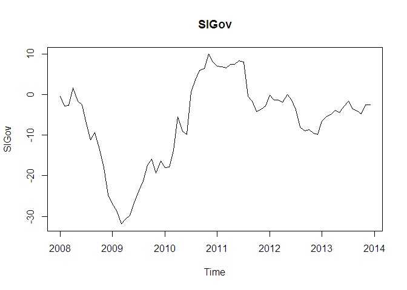<!-- -->

```r
cor(TotalAsIs, Births)
```

```
## [1] -0.1190228
```

```r
cor(EfakAsIs , Births)
```

```
## [1] -0.05802961
```

```r
cor(WugeAsIs, Births)
```

```
## [1] -0.007371339
```

```r
cor(TotalEtelAsIs, Births)
```

```
## [1] -0.1504242
```

```r
cor(BlueEtelAsIs , Births)
```

```
## [1] -0.2812913
```

```r
cor(RedEtelAsIs , Births)
```

```
## [1] -0.1217222
```

# Monthly Satisfaction Index (SI) external index 

```r
SIExternVector <- c(ImportedIndicators[58:69,2],ImportedIndicators[58:69,3],ImportedIndicators[58:69,4],ImportedIndicators[58:69,5],ImportedIndicators[58:69,6],ImportedIndicators[58:69,7])
SIExtern <- ts(SIExternVector, start=c(2008,1), end=c(2013,12), frequency=12)
plot(SIExtern, main="SIExtern")
```

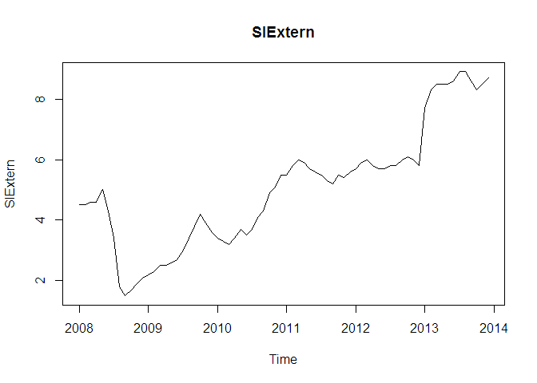<!-- -->

```r
cor(TotalAsIs, SIExtern)
```

```
## [1] 0.5883122
```

```r
cor(EfakAsIs , SIExtern)
```

```
## [1] 0.8358147
```

```r
cor(WugeAsIs, SIExtern)
```

```
## [1] 0.6786552
```

```r
cor(TotalEtelAsIs, SIExtern)
```

```
## [1] 0.2865672
```

```r
cor(BlueEtelAsIs , SIExtern)
```

```
## [1] 0.1604768
```

```r
cor(RedEtelAsIs , SIExtern)
```

```
## [1] 0.2960946
```

# Yearly exports from Urbano

```r
UrbanoExportsVector <- c(ImportedIndicators[72:83,2],ImportedIndicators[72:83,3],ImportedIndicators[72:83,4],ImportedIndicators[72:83,5],ImportedIndicators[72:83,6],ImportedIndicators[72:83,7])
UrbanoExports <- ts(UrbanoExportsVector, start=c(2008,1), end=c(2013,12), frequency=12)
plot(UrbanoExports, main="UrbanoExports")
```

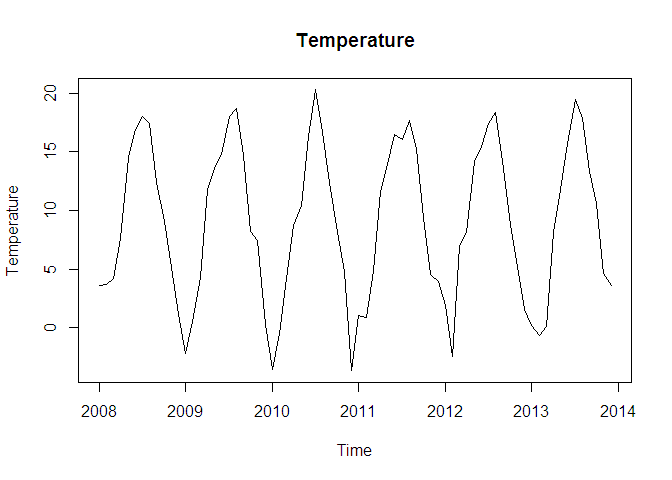<!-- -->

```r
cor(TotalAsIs, UrbanoExports)
```

```
## [1] 0.638178
```

```r
cor(EfakAsIs , UrbanoExports)
```

```
## [1] 0.9163565
```

```r
cor(WugeAsIs, UrbanoExports)
```

```
## [1] 0.7118468
```

```r
cor(TotalEtelAsIs, UrbanoExports)
```

```
## [1] 0.3182532
```

```r
cor(BlueEtelAsIs , UrbanoExports)
```

```
## [1] 0.1655794
```

```r
cor(RedEtelAsIs , UrbanoExports)
```

```
## [1] 0.3309962
```

# Yearly number of Globalisation Party members in Chulwalar

```r
GlobalisationPartyMembersVector <- c(ImportedIndicators[86:97,2],ImportedIndicators[86:97,3],ImportedIndicators[86:97,4],ImportedIndicators[86:97,5],ImportedIndicators[86:97,6],ImportedIndicators[86:97,7])
GlobalisationPartyMembers <- ts(GlobalisationPartyMembersVector, start=c(2008,1), end=c(2013,12), frequency=12)
plot(GlobalisationPartyMembers, main="GlobalisationPartyMembers")
```

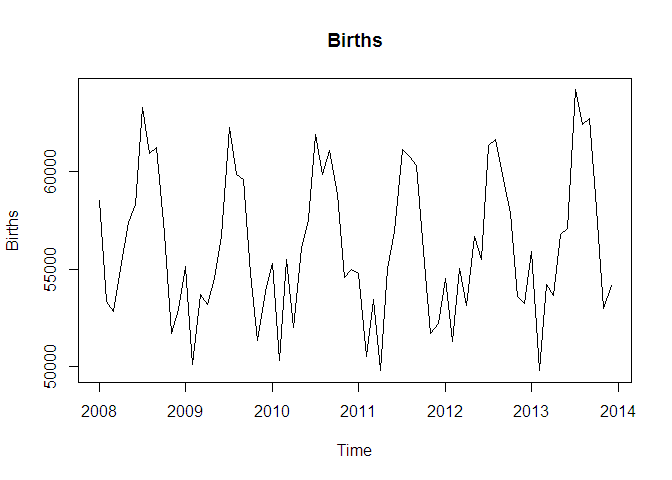<!-- -->

```r
cor(TotalAsIs, GlobalisationPartyMembers)
```

```
## [1] 0.630084
```

```r
cor(EfakAsIs , GlobalisationPartyMembers)
```

```
## [1] 0.8963942
```

```r
cor(WugeAsIs, GlobalisationPartyMembers)
```

```
## [1] 0.7193864
```

```r
cor(TotalEtelAsIs, GlobalisationPartyMembers)
```

```
## [1] 0.2994635
```

```r
cor(BlueEtelAsIs , GlobalisationPartyMembers)
```

```
## [1] 0.08547266
```

```r
cor(RedEtelAsIs , GlobalisationPartyMembers)
```

```
## [1] 0.3234832
```

# Monthly Average Export Price Index for Chulwalar

```r
AEPIVector <- c(ImportedIndicators[100:111,2],ImportedIndicators[100:111,3],ImportedIndicators[100:111,4],ImportedIndicators[100:111,5],ImportedIndicators[100:111,6],ImportedIndicators[100:111,7])
AEPI <- ts(AEPIVector, start=c(2008,1), end=c(2013,12), frequency=12)
plot(AEPI, main="AEPI")
```

<!-- -->

```r
cor(TotalAsIs, AEPI)
```

```
## [1] 0.625232
```

```r
cor(EfakAsIs , AEPI)
```

```
## [1] 0.9056624
```

```r
cor(WugeAsIs, AEPI)
```

```
## [1] 0.7159733
```

```r
cor(TotalEtelAsIs, AEPI)
```

```
## [1] 0.3035506
```

```r
cor(BlueEtelAsIs , AEPI)
```

```
## [1] 0.1577964
```

```r
cor(RedEtelAsIs , AEPI)
```

```
## [1] 0.3157277
```

# Monthly Producer Price Index (PPI) for Etel in Chulwalar

```r
PPIEtelVector <- c(ImportedIndicators[114:125,2],ImportedIndicators[114:125,3],ImportedIndicators[114:125,4],ImportedIndicators[114:125,5],ImportedIndicators[114:125,6],ImportedIndicators[114:125,7])
PPIEtel <- ts(PPIEtelVector, start=c(2008,1), end=c(2013,12), frequency=12)
plot(PPIEtel, main="PPIEtel")
```

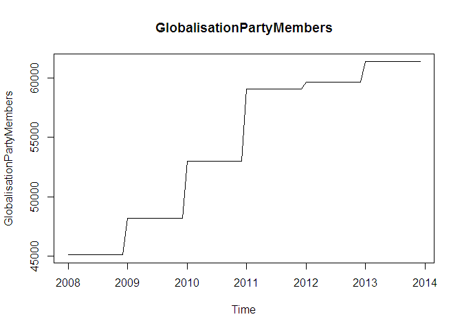<!-- -->

```r
cor(TotalAsIs, PPIEtel)
```

```
## [1] 0.4836129
```

```r
cor(EfakAsIs , PPIEtel)
```

```
## [1] 0.5865375
```

```r
cor(WugeAsIs, PPIEtel)
```

```
## [1] 0.4920865
```

```r
cor(TotalEtelAsIs, PPIEtel)
```

```
## [1] 0.3374707
```

```r
cor(BlueEtelAsIs , PPIEtel)
```

```
## [1] 0.2445472
```

```r
cor(RedEtelAsIs , PPIEtel)
```

```
## [1] 0.3391872
```

# National Holidays

```r
NationalHolidaysVector <- c(ImportedIndicators[170:181,2],ImportedIndicators[170:181,3],ImportedIndicators[170:181,4],ImportedIndicators[170:181,5],ImportedIndicators[170:181,6],ImportedIndicators[170:181,7])
NationalHolidays <- ts(NationalHolidaysVector, start=c(2008,1), end=c(2013,12), frequency=12)
plot(NationalHolidays, main="NationalHolidays")
```

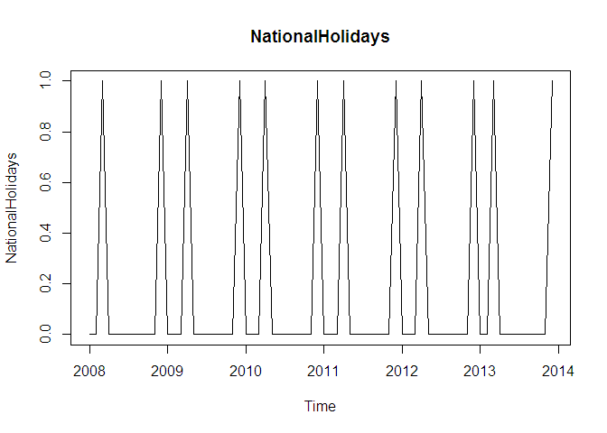<!-- -->

```r
cor(TotalAsIs, NationalHolidays)
```

```
## [1] -0.007883708
```

```r
cor(EfakAsIs , NationalHolidays)
```

```
## [1] 0.001235706
```

```r
cor(WugeAsIs, NationalHolidays)
```

```
## [1] 0.06505569
```

```r
cor(TotalEtelAsIs, NationalHolidays)
```

```
## [1] -0.01081446
```

```r
cor(BlueEtelAsIs , NationalHolidays)
```

```
## [1] 0.02903763
```

```r
cor(RedEtelAsIs , NationalHolidays)
```

```
## [1] -0.01717636
```

# Chulwalar Index (Total value of all companies in Chulwalar)

```r
ChulwalarIndexVector <- c(ImportedIndicators[128:139,2],ImportedIndicators[128:139,3],ImportedIndicators[128:139,4],ImportedIndicators[128:139,5],ImportedIndicators[128:139,6],ImportedIndicators[128:139,7])
ChulwalarIndex <- ts(ChulwalarIndexVector, start=c(2008,1), end=c(2013,12), frequency=12)
plot(ChulwalarIndex, main="ChulwalarIndex")
```

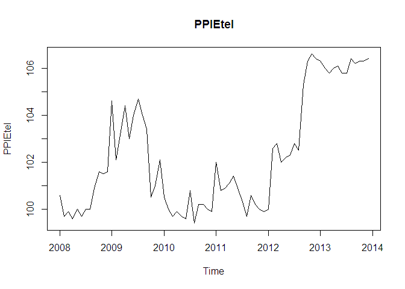<!-- -->

```r
cor(TotalAsIs, ChulwalarIndex)
```

```
## [1] 0.4837017
```

```r
cor(EfakAsIs , ChulwalarIndex)
```

```
## [1] 0.7129557
```

```r
cor(WugeAsIs, ChulwalarIndex)
```

```
## [1] 0.5721568
```

```r
cor(TotalEtelAsIs, ChulwalarIndex)
```

```
## [1] 0.2209171
```

```r
cor(BlueEtelAsIs , ChulwalarIndex)
```

```
## [1] 0.1469233
```

```r
cor(RedEtelAsIs , ChulwalarIndex)
```

```
## [1] 0.2242922
```

# Monthly Inflation rate in Chulwalar 

```r
InflationVector <- c(ImportedIndicators[142:153,2],ImportedIndicators[142:153,3],ImportedIndicators[142:153,4],ImportedIndicators[142:153,5],ImportedIndicators[142:153,6],ImportedIndicators[142:153,7])
Inflation <- ts(InflationVector, start=c(2008,1), end=c(2013,12), frequency=12)
plot(Inflation, main="Inflation")
```

<!-- -->

```r
cor(TotalAsIs, Inflation)
```

```
## [1] 0.002438708
```

```r
cor(EfakAsIs , Inflation)
```

```
## [1] 0.1454134
```

```r
cor(WugeAsIs, Inflation)
```

```
## [1] 0.03191332
```

```r
cor(TotalEtelAsIs, Inflation)
```

```
## [1] -0.08378282
```

```r
cor(BlueEtelAsIs , Inflation)
```

```
## [1] 0.02117817
```

```r
cor(RedEtelAsIs , Inflation)
```

```
## [1] -0.0982151
```

# Proposed spending for Independence day presents

```r
IndependenceDayPresentsVector <- c(ImportedIndicators[156:167,2],ImportedIndicators[156:167,3],ImportedIndicators[156:167,4],ImportedIndicators[156:167,5],ImportedIndicators[156:167,6],ImportedIndicators[156:167,7])
IndependenceDayPresents <- ts(IndependenceDayPresentsVector, start=c(2008,1), end=c(2013,12), frequency=12)
plot(IndependenceDayPresents, main="IndependenceDayPresents")
```

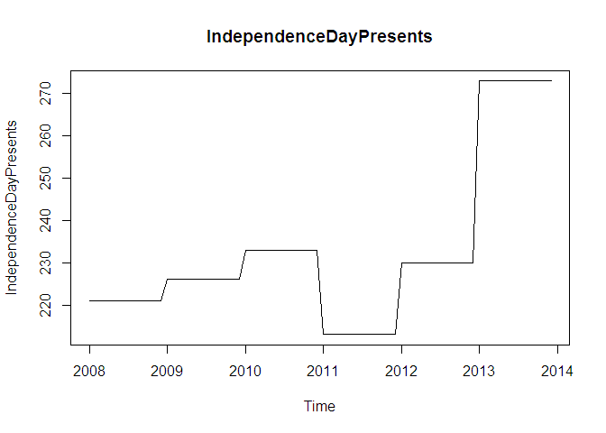<!-- -->

```r
cor(TotalAsIs, IndependenceDayPresents)
```

```
## [1] 0.4359522
```

```r
cor(EfakAsIs , IndependenceDayPresents)
```

```
## [1] 0.5243145
```

```r
cor(WugeAsIs, IndependenceDayPresents)
```

```
## [1] 0.4892437
```

```r
cor(TotalEtelAsIs, IndependenceDayPresents)
```

```
## [1] 0.2872013
```

```r
cor(BlueEtelAsIs , IndependenceDayPresents)
```

```
## [1] 0.2110373
```

```r
cor(RedEtelAsIs , IndependenceDayPresents)
```

```
## [1] 0.2881631
```

# Influence of National Holidays :
This indicator is an experiment where the influence of National Holidays is extended into the months leading up to the holiday. However later tests show that this indicator is no better for forecasting than the orignial National Holidays indicator.  

```r
InfluenceNationalHolidaysVector <- c(ImportedIndicators[184:195,2],ImportedIndicators[184:195,3],ImportedIndicators[184:195,4],ImportedIndicators[184:195,5],ImportedIndicators[184:195,6],ImportedIndicators[184:195,7])
InfluenceNationalHolidays <- ts(InfluenceNationalHolidaysVector, start=c(2008,1), end=c(2013,12), frequency=12)
plot(InfluenceNationalHolidays, main="InfluenceNationalHolidays")
```

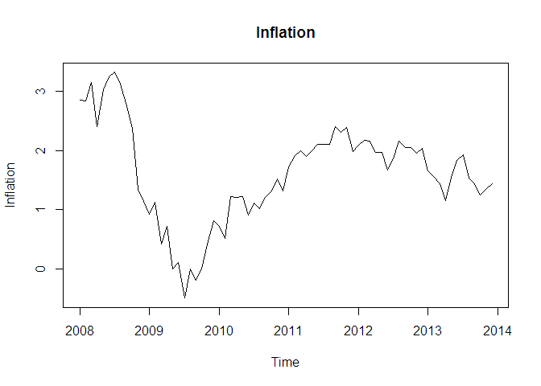<!-- -->

```r
cor(TotalAsIs, InfluenceNationalHolidays)
```

```
## [1] 0.3717463
```

```r
cor(EfakAsIs , InfluenceNationalHolidays)
```

```
## [1] 0.09926836
```

```r
cor(WugeAsIs, InfluenceNationalHolidays)
```

```
## [1] 0.3712288
```

```r
cor(TotalEtelAsIs, InfluenceNationalHolidays)
```

```
## [1] 0.4535836
```

```r
cor(BlueEtelAsIs , InfluenceNationalHolidays)
```

```
## [1] 0.2792198
```

```r
cor(RedEtelAsIs , InfluenceNationalHolidays)
```

```
## [1] 0.4643512
```

# Check that the data import has worked

```r
str(CEPIVector)
```

```
##  num [1:72] 97.4 97.8 98.3 98.1 98.7 98.9 99.5 99.2 99.1 98.9 ...
```

```r
str(SIGovVector)  
```

```
##  num [1:72] -0.4 -2.9 -2.7 1.7 -1.7 -2.6 -7.1 -11.1 -9.4 -13.5 ...
```

```r
str(TemperatureVector) 
```

```
##  num [1:72] 3.6 3.7 4.2 7.6 14.5 16.9 18 17.4 12.4 9.1 ...
```

```r
str(BirthsVector)
```

```
##  num [1:72] 58519 53370 52852 55048 57398 ...
```

```r
str(SIExternVector)
```

```
##  num [1:72] 4.5 4.5 4.6 4.6 5 4.3 3.4 1.8 1.5 1.7 ...
```

```r
str(UrbanoExportsVector) 
```

```
##  num [1:72] 5850000 5850000 5850000 5850000 5850000 5850000 5850000 5850000 5850000 5850000 ...
```

```r
str(GlobalisationPartyMembersVector)
```

```
##  num [1:72] 45089 45089 45089 45089 45089 ...
```

```r
str(AEPIVector) 
```

```
##  num [1:72] 99 99.3 99.5 99.2 99.5 ...
```

```r
str(PPIEtelVector) 
```

```
##  num [1:72] 100.6 99.7 99.9 99.6 100 ...
```

```r
str(NationalHolidaysVector) 
```

```
##  num [1:72] 0 0 1 0 0 0 0 0 0 0 ...
```

```r
str(ChulwalarIndexVector)
```

```
##  num [1:72] 6852 6748 6535 6949 7097 ...
```

```r
str(InflationVector) 
```

```
##  num [1:72] 2.85 2.84 3.15 2.4 3.03 3.24 3.32 3.12 2.8 2.38 ...
```

```r
str(IndependenceDayPresentsVector)
```

```
##  num [1:72] 221 221 221 221 221 221 221 221 221 221 ...
```

# Forecasting models with smoothing and related approaches
Exponential Smoothing uses past values to calculate a forecast. The strength with which each value influences the forecast is weakened with help of a smoothing parameter. Thus we are dealing with a weighted average, whose values fade out the longer ago they were in the past.

The Akaike's Information Criterion(AIC/AICc) or the Bayesian Information Criterion (BIC) should be at minimum.

## Simple expontential smoothing    

```r
Model_ses <- ses(TotalAsIs, h=12)
summary(Model_ses)
```

```
## 
## Forecast method: Simple exponential smoothing
## 
## Model Information:
## Simple exponential smoothing 
## 
## Call:
##  ses(x = TotalAsIs, h = 12) 
## 
##   Smoothing parameters:
##     alpha = 0.671 
## 
##   Initial states:
##     l = 2173226.7433 
## 
##   sigma:  609507
## 
##      AIC     AICc      BIC 
## 2230.058 2230.232 2234.612 
## 
## Error measures:
##                    ME   RMSE      MAE       MPE     MAPE     MASE
## Training set 47469.84 609507 429997.1 -1.511008 15.02336 1.172074
##                    ACF1
## Training set 0.02384493
## 
## Forecasts:
##          Point Forecast   Lo 80   Hi 80   Lo 95   Hi 95
## Jan 2014        4466448 3685333 5247562 3271836 5661059
## Feb 2014        4466448 3525801 5407094 3027853 5905042
## Mar 2014        4466448 3389650 5543245 2819628 6113267
## Apr 2014        4466448 3268880 5664015 2634926 6297969
## May 2014        4466448 3159220 5773675 2467215 6465680
## Jun 2014        4466448 3058072 5874823 2312524 6620371
## Jul 2014        4466448 2963718 5969177 2168221 6764674
## Aug 2014        4466448 2874947 6057948 2032458 6900437
## Sep 2014        4466448 2790873 6142022 1903878 7029017
## Oct 2014        4466448 2710821 6222074 1781448 7151447
## Nov 2014        4466448 2634263 6298632 1664363 7268532
## Dec 2014        4466448 2560778 6372117 1551977 7380918
```

```r
OverallSummary <- GetForecastStats(Model_ses)
plot(Model_ses, plot.conf=FALSE, ylab="Exports Chulwalar  )", xlab="Year", main="", fcol="white", type="o")
lines(fitted(Model_ses), col="green", type="o")
lines(Model_ses$mean, col="blue", type="o")
legend("topleft",lty=1, col=c(1,"green"), c("data", expression(alpha == 0.671)),pch=1)
```

<!-- -->

## Holt's linear trend method   
Holt added to the model in order to forecast using trends as well. For this it is necessary to add a beta, which determines the trend. If neither alpha nor beta is stated, both parameters will be optimised using ets(). The trend is exponential if the intercepts(level) and the gradient (slope) are multiplied with eachother. The values are worse. As the Beta was very low in the optimisation, the forecast is very similar to the ses() model. 


```r
Model_holt_1 <- holt(TotalAsIs,h=12)
summary(Model_holt_1)
```

```
## 
## Forecast method: Holt's method
## 
## Model Information:
## Holt's method 
## 
## Call:
##  holt(x = TotalAsIs, h = 12) 
## 
##   Smoothing parameters:
##     alpha = 0.6571 
##     beta  = 1e-04 
## 
##   Initial states:
##     l = 2040390.7764 
##     b = 45050.7514 
## 
##   sigma:  608119.1
## 
##      AIC     AICc      BIC 
## 2233.730 2234.327 2242.837 
## 
## Error measures:
##                    ME     RMSE      MAE      MPE     MAPE     MASE
## Training set -16586.9 608119.1 441110.7 -3.88925 15.75307 1.202367
##                    ACF1
## Training set 0.03462672
## 
## Forecasts:
##          Point Forecast   Lo 80   Hi 80   Lo 95   Hi 95
## Jan 2014        4536367 3757031 5315703 3344475 5728259
## Feb 2014        4581298 3648703 5513894 3155016 6007580
## Mar 2014        4626230 3562188 5690271 2998918 6253541
## Apr 2014        4671161 3490181 5852141 2865008 6477314
## May 2014        4716092 3428721 6003463 2747228 6684956
## Jun 2014        4761024 3375378 6146669 2641862 6880185
## Jul 2014        4805955 3328531 6283379 2546429 7065480
## Aug 2014        4850886 3287035 6414738 2459182 7242591
## Sep 2014        4895818 3250047 6541588 2378829 7412807
## Oct 2014        4940749 3216925 6664573 2304387 7577111
## Nov 2014        4985680 3187164 6784196 2235088 7736273
## Dec 2014        5030612 3160363 6900860 2170314 7890909
```

```r
plot(Model_holt_1)
```

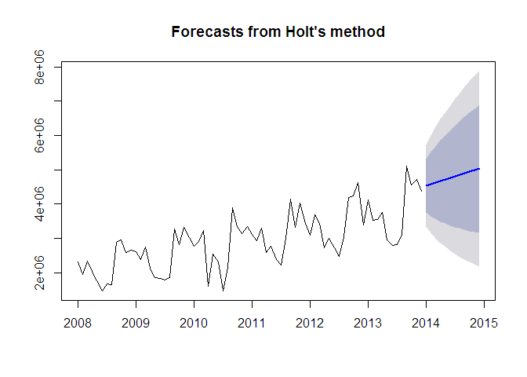<!-- -->

```r
# expoential trend
Model_holt_2<- holt(TotalAsIs, exponential=TRUE,h=12)
summary(Model_holt_2)
```

```
## 
## Forecast method: Holt's method with exponential trend
## 
## Model Information:
## Holt's method with exponential trend 
## 
## Call:
##  holt(x = TotalAsIs, h = 12, exponential = TRUE) 
## 
##   Smoothing parameters:
##     alpha = 0.6637 
##     beta  = 1e-04 
## 
##   Initial states:
##     l = 2041538.9468 
##     b = 1.0029 
## 
##   sigma:  0.2438
## 
##      AIC     AICc      BIC 
## 2251.010 2251.607 2260.116 
## 
## Error measures:
##                    ME     RMSE      MAE       MPE     MAPE     MASE
## Training set 37825.61 609787.5 433018.9 -1.838214 15.18487 1.180311
##                    ACF1
## Training set 0.02918287
## 
## Forecasts:
##          Point Forecast   Lo 80   Hi 80   Lo 95    Hi 95
## Jan 2014        4488281 3080407 5903910 2331280  6632236
## Feb 2014        4502175 2876585 6194477 2096077  7308659
## Mar 2014        4516113 2675687 6525418 2010858  7991418
## Apr 2014        4530094 2546260 6804114 1820538  8417861
## May 2014        4544118 2403509 7014769 1673054  8929135
## Jun 2014        4558186 2264052 7221292 1622395  9174209
## Jul 2014        4572297 2143615 7379725 1451866  9708083
## Aug 2014        4586452 2047241 7415473 1361305 10049253
## Sep 2014        4600650 1974607 7649635 1292295 10865180
## Oct 2014        4614893 1877777 7785452 1226587 11106712
## Nov 2014        4629180 1809652 7968823 1188529 11403040
## Dec 2014        4643510 1779687 8113207 1117772 11742226
```

```r
plot(Model_holt_2)
```

<!-- -->

## Dampened trends
As such simple trends tend to forecast the future to positively, we have added a dampener. This also works for exponential trends. We also plot the level and slope individually for each model.

```r
Model_holt_3 <- holt(TotalAsIs, damped=TRUE,h=12)
summary(Model_holt_3)
```

```
## 
## Forecast method: Damped Holt's method
## 
## Model Information:
## Damped Holt's method 
## 
## Call:
##  holt(x = TotalAsIs, h = 12, damped = TRUE) 
## 
##   Smoothing parameters:
##     alpha = 0.6613 
##     beta  = 2e-04 
##     phi   = 0.98 
## 
##   Initial states:
##     l = 2040392.5761 
##     b = 45053.25 
## 
##   sigma:  608787.2
## 
##      AIC     AICc      BIC 
## 2235.888 2236.797 2247.272 
## 
## Error measures:
##                    ME     RMSE      MAE       MPE     MAPE     MASE
## Training set 15578.94 608787.2 436909.7 -2.797612 15.46526 1.190916
##                    ACF1
## Training set 0.03351419
## 
## Forecasts:
##          Point Forecast   Lo 80   Hi 80   Lo 95   Hi 95
## Jan 2014        4483618 3703426 5263811 3290417 5676819
## Feb 2014        4493914 3558436 5429391 3063224 5924603
## Mar 2014        4504003 3435520 5572486 2869899 6138107
## Apr 2014        4513891 3327168 5700614 2698955 6328827
## May 2014        4523581 3229332 5817829 2544198 6502963
## Jun 2014        4533077 3139534 5926619 2401837 6664316
## Jul 2014        4542383 3056128 6028638 2269352 6815413
## Aug 2014        4551503 2977955 6125051 2144969 6958036
## Sep 2014        4560440 2904162 6216719 2027381 7093499
## Oct 2014        4569199 2834101 6304298 1915595 7222803
## Nov 2014        4577783 2767264 6388301 1808834 7346732
## Dec 2014        4586195 2703249 6469141 1706477 7465913
```

```r
plot(Model_holt_3)
```

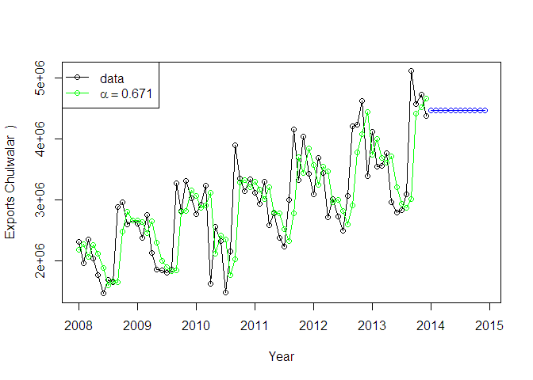<!-- -->

```r
Model_holt_4 <- holt(TotalAsIs, exponential=TRUE, damped=TRUE,h=12)
summary(Model_holt_4)
```

```
## 
## Forecast method: Damped Holt's method with exponential trend
## 
## Model Information:
## Damped Holt's method with exponential trend 
## 
## Call:
##  holt(x = TotalAsIs, h = 12, damped = TRUE, exponential = TRUE) 
## 
##   Smoothing parameters:
##     alpha = 0.6679 
##     beta  = 1e-04 
##     phi   = 0.9799 
## 
##   Initial states:
##     l = 2041541.9705 
##     b = 1.0019 
## 
##   sigma:  0.2449
## 
##      AIC     AICc      BIC 
## 2253.216 2254.125 2264.600 
## 
## Error measures:
##                    ME     RMSE      MAE       MPE     MAPE     MASE
## Training set 46119.56 609906.7 432069.1 -1.549114 15.11987 1.177722
##                   ACF1
## Training set 0.0254941
## 
## Forecasts:
##          Point Forecast   Lo 80   Hi 80   Lo 95    Hi 95
## Jan 2014        4470648 3035985 5861550 2342420  6598411
## Feb 2014        4473164 2835808 6216116 2194181  7287131
## Mar 2014        4475630 2622340 6440193 1924958  7900448
## Apr 2014        4478047 2496599 6751278 1806315  8288531
## May 2014        4480418 2314000 6871344 1639571  8934331
## Jun 2014        4482742 2183775 7073383 1556967  9194381
## Jul 2014        4485020 2080247 7366194 1424078  9733713
## Aug 2014        4487253 1966632 7510150 1335728 10177057
## Sep 2014        4489443 1904476 7778241 1218395 10723457
## Oct 2014        4491589 1767518 7956309 1128967 10993558
## Nov 2014        4493694 1717426 7968734 1098636 11838950
## Dec 2014        4495757 1655578 8077403 1059859 12001403
```

```r
plot(Model_holt_4)
```

<!-- -->

```r
# level and slope can be plotted individually for each model. 
plot(Model_holt_1$model$state)
```

<!-- -->

```r
plot(Model_holt_2$model$state)
```

<!-- -->

```r
plot(Model_holt_3$model$state)
```

<!-- -->

```r
plot(Model_holt_4$model$state)
```

<!-- -->

```r
plot(Model_holt_1, plot.conf=FALSE, ylab="Exports Chulwalar  )", xlab="Year", main="", fcol="white", type="o")
lines(fitted(Model_ses), col="purple", type="o")
lines(fitted(Model_holt_1), col="blue", type="o")
lines(fitted(Model_holt_2), col="red", type="o")
lines(fitted(Model_holt_3), col="green", type="o")
lines(fitted(Model_holt_4), col="orange", type="o")
lines(Model_ses$mean, col="purple", type="o")
lines(Model_holt_1$mean, col="blue", type="o")
lines(Model_holt_2$mean, col="red", type="o")
lines(Model_holt_3$mean, col="green", type="o")
lines(Model_holt_4$mean, col="orange", type="o")
legend("topleft",lty=1, col=c(1,"purple","blue","red","green","orange"), c("data", "SES","Holts auto", "Exponential", "Additive Damped", "Multiplicative Damped"),pch=1)
```

<!-- -->

## Holt-Winter's seasonal method   
Holt and Winters have expanded Holt's model further to include the seasonality aspect. The parameter gamma, which is for smoothing the seasonality, was added to achieve this. The values are better than the models without seasonality. This is logical, since the data is strongly influenced by seasonality.  In the following model, none of the parameters are given so that they will be optimised automatically. There are two models: one using an additive error model method and one using a multiplicative error model. The additive model gives slightly better results than the multiplicative model.


```r
Model_hw_1 <- hw(TotalAsIs ,seasonal="additive",h=12)
summary(Model_hw_1)
```

```
## 
## Forecast method: Holt-Winters' additive method
## 
## Model Information:
## Holt-Winters' additive method 
## 
## Call:
##  hw(x = TotalAsIs, h = 12, seasonal = "additive") 
## 
##   Smoothing parameters:
##     alpha = 0.0087 
##     beta  = 0.0087 
##     gamma = 1e-04 
## 
##   Initial states:
##     l = 2047375.0884 
##     b = 22509.7631 
##     s=259168.3 654942.6 474529.8 876025.2 -475155 -852844
##            -664662.5 -412596.7 -438677.3 273215 138077.9 167976.7
## 
##   sigma:  241685
## 
##      AIC     AICc      BIC 
## 2124.856 2134.747 2161.283 
## 
## Error measures:
##                    ME   RMSE      MAE         MPE     MAPE      MASE
## Training set 21615.43 241685 202218.5 -0.08252109 7.329458 0.5512016
##                    ACF1
## Training set -0.2819072
## 
## Forecasts:
##          Point Forecast   Lo 80   Hi 80   Lo 95   Hi 95
## Jan 2014        4141204 3831472 4450936 3667510 4614898
## Feb 2014        4147309 3837472 4457147 3673453 4621165
## Mar 2014        4318537 4008512 4628563 3844394 4792680
## Apr 2014        3642744 3332425 3953063 3168153 4117335
## May 2014        3704865 3394124 4015605 3229628 4180102
## Jun 2014        3488859 3177546 3800173 3012746 3964973
## Jul 2014        3336738 3024677 3648799 2859482 3813994
## Aug 2014        3750478 3437474 4063482 3271780 4229176
## Sep 2014        5137771 4823607 5451935 4657298 5618244
## Oct 2014        4772337 4456775 5087900 4289726 5254949
## Nov 2014        4988809 4671591 5306028 4503665 5473953
## Dec 2014        4629097 4309943 4948252 4140992 5117202
```

```r
plot(Model_hw_1)
```

<!-- -->

```r
Model_hw_2 <- hw(TotalAsIs ,seasonal="multiplicative",h=12)
summary(Model_hw_2)
```

```
## 
## Forecast method: Holt-Winters' multiplicative method
## 
## Model Information:
## Holt-Winters' multiplicative method 
## 
## Call:
##  hw(x = TotalAsIs, h = 12, seasonal = "multiplicative") 
## 
##   Smoothing parameters:
##     alpha = 0.025 
##     beta  = 0.0062 
##     gamma = 1e-04 
## 
##   Initial states:
##     l = 2026247.531 
##     b = 25395.1259 
##     s=1.0933 1.232 1.1763 1.3086 0.8384 0.699
##            0.7653 0.8502 0.8596 1.0793 1.0316 1.0665
## 
##   sigma:  0.0877
## 
##      AIC     AICc      BIC 
## 2128.303 2138.194 2164.729 
## 
## Error measures:
##                    ME     RMSE      MAE        MPE     MAPE      MASE
## Training set 17434.11 235296.6 191805.3 -0.3292809 7.213472 0.5228175
##                    ACF1
## Training set -0.3514421
## 
## Forecasts:
##          Point Forecast   Lo 80   Hi 80   Lo 95   Hi 95
## Jan 2014        4226941 3751624 4702258 3500006 4953876
## Feb 2014        4123665 3659738 4587591 3414151 4833179
## Mar 2014        4350808 3860995 4840620 3601704 5099911
## Apr 2014        3494208 3100476 3887940 2892046 4096370
## May 2014        3484738 3091618 3877858 2883513 4085963
## Jun 2014        3162774 2805463 3520085 2616314 3709234
## Jul 2014        2912399 2582802 3241996 2408324 3416474
## Aug 2014        3521645 3122278 3921013 2910865 4132425
## Sep 2014        5540988 4911109 6170867 4577671 6504304
## Oct 2014        5020487 4448200 5592775 4145249 5895725
## Nov 2014        5299729 4693715 5905743 4372911 6226547
## Dec 2014        4740169 4196230 5284108 3908286 5572052
```

```r
plot(Model_hw_2)
```

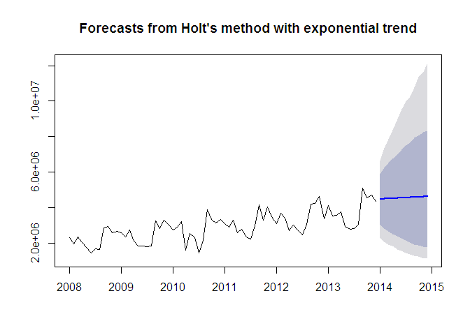<!-- -->

```r
plot(Model_hw_1, ylab="Exports Chulwalar  ", plot.conf=FALSE, type="o", fcol="white", xlab="Year")
lines(fitted(Model_hw_1), col="red", lty=2)
lines(fitted(Model_hw_2), col="green", lty=2)
lines(Model_hw_1$mean, type="o", col="red")
lines(Model_hw_2$mean, type="o", col="green")
legend("topleft",lty=1, pch=1, col=1:3, c("data","Holt Winters' Additive","Holt Winters' Multiplicative"))
```

<!-- -->

```r
# In order to use the results later, they need to be converted into point forcasts.
Model_hw_1_df <-as.data.frame(Model_hw_1) 
Model_hw_1_PointForecast <- ts(Model_hw_1_df$"Point Forecast", start=c(2014,1), end=c(2014,12), frequency=12)
Model_hw_1_PointForecast
```

```
##          Jan     Feb     Mar     Apr     May     Jun     Jul     Aug
## 2014 4141204 4147309 4318537 3642744 3704865 3488859 3336738 3750478
##          Sep     Oct     Nov     Dec
## 2014 5137771 4772337 4988809 4629097
```

```r
Model_hw_2_df <-as.data.frame(Model_hw_2) 
Model_hw_2_PointForecast <- ts(Model_hw_2_df$"Point Forecast", start=c(2014,1), end=c(2014,12), frequency=12)
Model_hw_2_PointForecast
```

```
##          Jan     Feb     Mar     Apr     May     Jun     Jul     Aug
## 2014 4226941 4123665 4350808 3494208 3484738 3162774 2912399 3521645
##          Sep     Oct     Nov     Dec
## 2014 5540988 5020487 5299729 4740169
```

```r
# Output instruction for the data export of the results for further use in Excel.
#write.csv(Model_hw_1_PointForecast,file='Model_hw_1_PointForecast.csv')
#write.csv(Model_hw_2_PointForecast,file='Model_hw_2_PointForecast.csv')
```

## Conclusion


* The ETS model was prefered over the ARIMA Model. In one sample ETS model, the Mean Absolute Squared Error of.55 was
  prefered 15 differnt ARIMA models with values greater than 1.0. ETS ME of 21,588 was prefered over wide ranging values
  of -18,789 to 178,628. Based on the review of the data, and the type of data being explored: Error, Trend, Seasonal
  algorithm "ETS AAA" is the  preferred method over autoregressive integrated moving average "ARIMA". ARIMA is based on
  assumptions that residuals are uncorrelated and normally distributed. If this doesn't occur, then forecast intervals are
  incorrect. "ETS AAA" doesn't face the same limitations of looking at correlations in data, linearity and stationarity.
  Also ETS provides an automatic way of selecting the best method. ETS MASE of .55 provides a better value of greater than
  0 but less than one.

* Reviewing the different model, to define the best fit is the model that proves the best prediction of error, robust to
  outliers, good indicator of central tendency and provides the best measure of goodness is the best fit.

* Holt's-Winters multiplicative method of MASE ".52", ME 17434.1, and RMSE  241,685 was prefered over other forecast
  models. When reviewing the different forecast models the root mean square error provided the best indicator for accurate
  forecasting.Taking into account seasonal fluctuations in the data was important during this case study. Lastly, when
  comparing "total-as-is" plan to the "total-plan" using linear regression model and time series models provided a better
  understanging of regression correlation and accuracy. The best fit for forecast is the model that provides the best time
  series review for your given data and the predication of bias and error in the data.   

* All of the models are equally good when considering the specific data. Based on observation and analysis of the data,
  any model that provides trend analyses, seasonal interpretation (additive/multiplicative) and greater interpretation of
  potential error is the one chosen. The model that produces an accurate forecast is a model that contains a low U1
  statistic. Important to consider Mean error values as well as taking into account a full range of values in a statisticl
  output 

## Recommendation to Chulwalr Prime Minister:
When reviewing the different plots between efak, Wuge, and Etel. The primary export recommended would be Efak. It shows a strong linear progression from 2008 and is resistant to large swings in seasonal, export, and social holidays.
